

# PA4 Submission: TaskFlow Pipeline

Copy this file to <code style="color:#111827;background:#ddd6fe;padding:2px 4px;border-radius:4px;">SUBMISSION.md</code>. Put every screenshot in <code style="color:#111827;background:#ddd6fe;padding:2px 4px;border-radius:4px;">docs/</code>, embed it under the correct task, and write a short description below each image explaining what it proves. The grader should not need any file outside this repository.

## Student Information

| Field | Value |
|---|---|
| Name | Muhammad Daniyal Khan |
| Roll Number | 26100266 |
| GitHub Repository URL | https://github.com/MuhammadDaniyalKhan098/CS487-PA4 |
| Resource Group | `rg-sp26-26100266` |
| Assigned Region | `ukwest` |

## Evidence Rules

- Use relative image paths, for example: ``.
- Every image must have a 1-3 sentence description below it.
- Azure Portal screenshots must show the resource name and enough page context to identify the service.
- CLI screenshots must show the command and output.
- Mask secrets such as function keys, ACR passwords, and storage connection strings.

## Task 1: App Service Web App (15 points)

### Evidence 1.1: Forked Repository

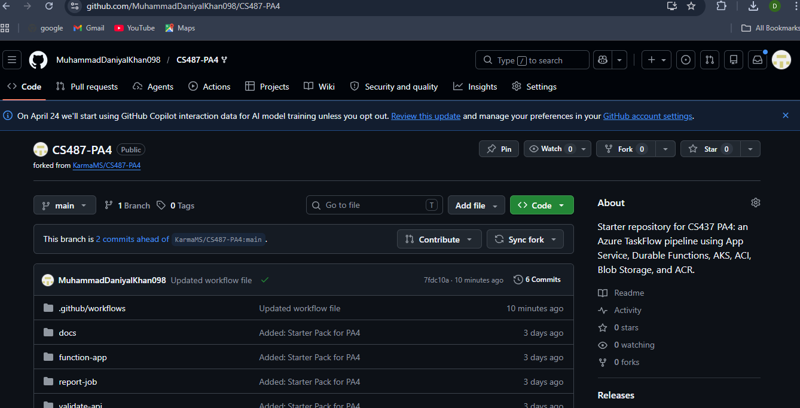

Description: This screenshot shows my working fork of the repository, MuhammadDaniyalKhan098/CS487-PA4, which contains the required starter structure and GitHub Actions workflows for the assignment.

### Evidence 1.2: App Service Overview

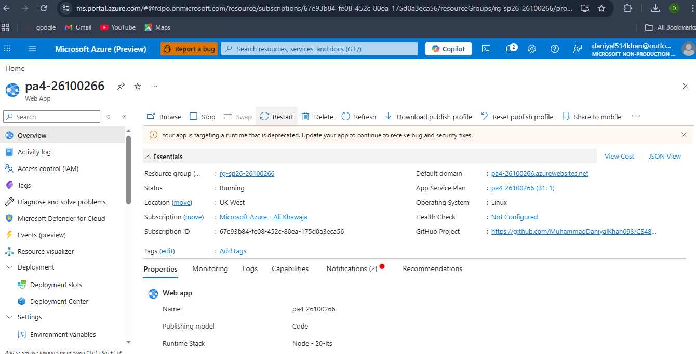

Description: The Overview page confirms the Web App pa4-26100266 is in a Running status within the rg-sp26-26100266 resource group and the UK West region. It is running on a Linux-based Node.js runtime stack.

### Evidence 1.3: Deployment Center / GitHub Actions

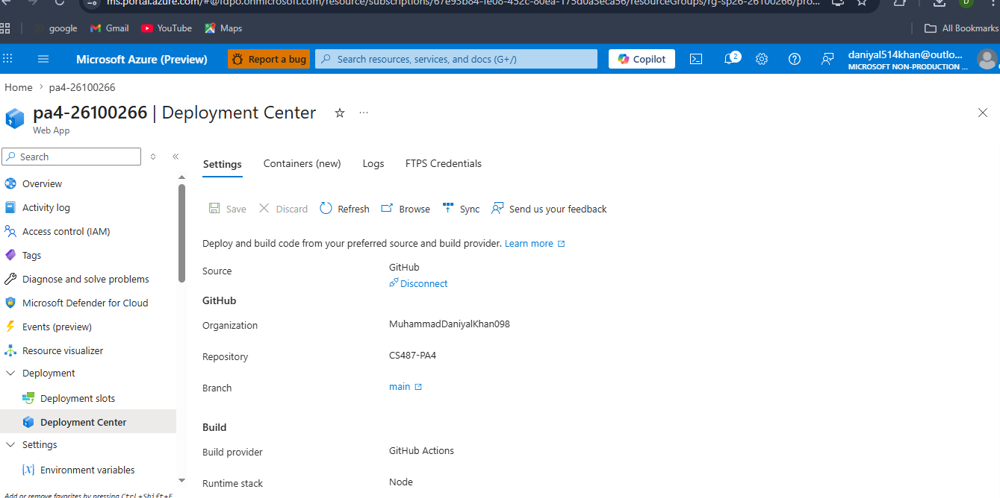

Description: This evidence from the Deployment Center shows that the Web App is successfully connected to the main branch of my GitHub fork. It also confirms that GitHub Actions is configured as the build and deployment provider.

### Evidence 1.4: Live Web UI

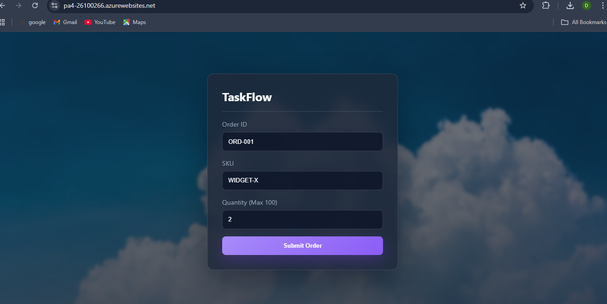

Description: This screenshot shows the TaskFlow frontend loaded at pa4-26100266.azurewebsites.net. The App Service is successfully serving the user interface, allowing for order entry and submission.

---

## Task 2: Azure Container Registry (15 points)

### Evidence 2.1: ACR Overview

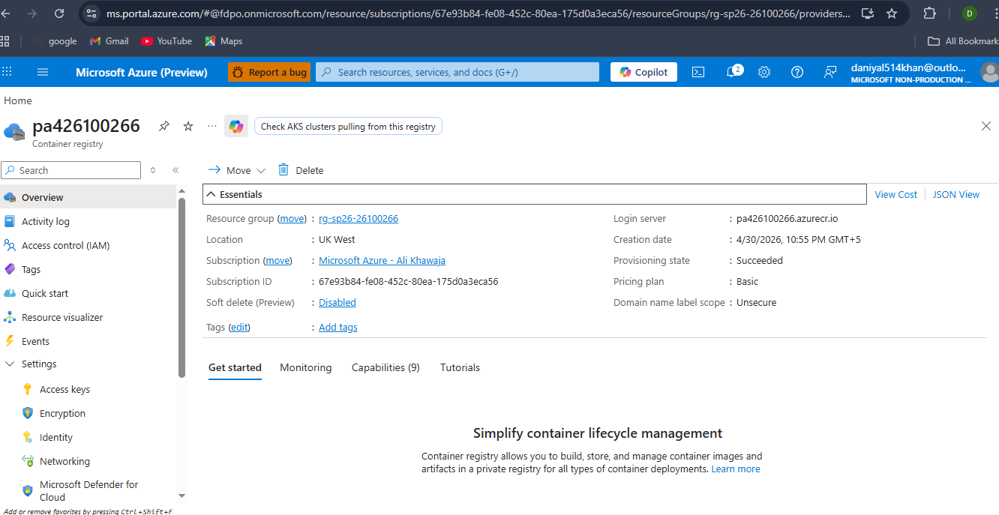

Description: This screenshot shows the Azure Container Registry pa426100266 successfully deployed within the rg-sp26-26100266 resource group. The registry is configured with the Basic pricing plan (SKU) and is located in the UK West region.

### Evidence 2.2: Docker Builds

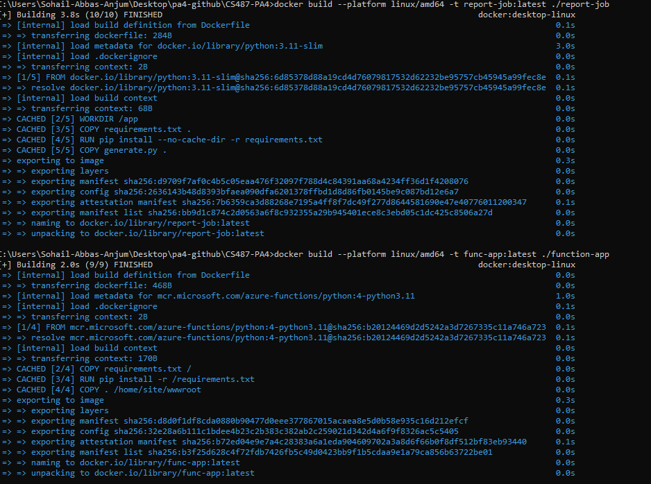

Description: This evidence shows successful local Docker builds for the project services using the linux/amd64 platform flag. The images were generated from the ./validate-api, ./report-job, and ./function-app folders respectively.

### Evidence 2.3: ACR Repositories

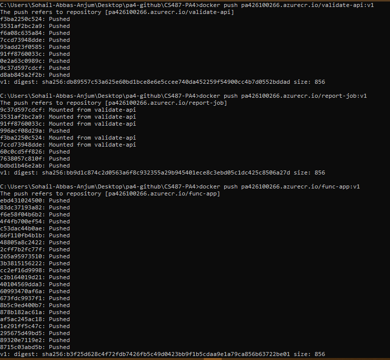

Description: The CLI output from az acr repository list confirms that all three required repositories func-app, report-job, and validate-api are present in the registry. Additional evidence from the docker push logs verifies that the v1 tags were successfully uploaded for each.

---

## Task 3: Durable Function Implementation (12 points)

### Evidence 3.1: Completed Function Code

[function_app.py](function-app/function_app.py)

Description: My orchestrator function (my_orchestrator) manages the sequential pipeline by first awaiting the validate_activity to confirm order quantity and SKU validity via the AKS service. If the order is valid, it then calls report_activity to initiate the ACI-based PDF generation job.

### Evidence 3.2: Local Function Handler Listing

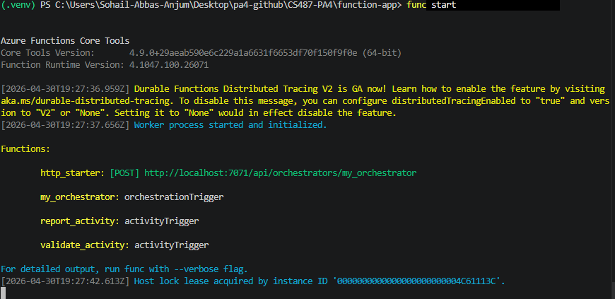

Description: The output from the func start command confirms that the Azure Functions Core Tools successfully discovered and initialized all required handlers: the HTTP starter, the central orchestrator, and both activity functions. This ensures the local runtime is correctly configured to execute the Durable Functions logic.

---

## Task 4: Function App Container Deployment (8 points)

### Evidence 4.1: Function App Container Configuration

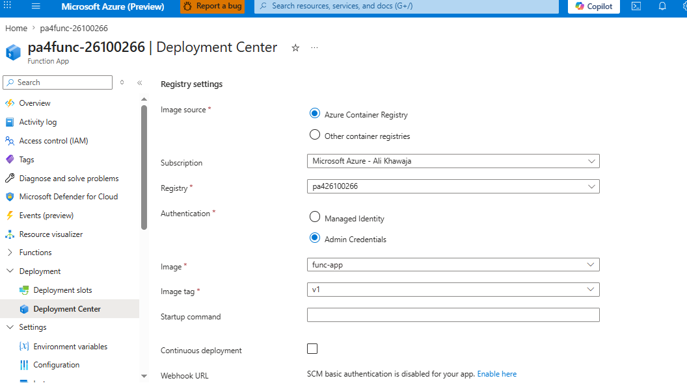

Description: The Deployment Center confirms the Function App is configured to 
pull the func-app:v1 image from the pa426100266 Azure Container Registry using 
Admin Credentials. The full image URI is pa426100266.azurecr.io/func-app:v1.

### Evidence 4.2: Orchestration Smoke Test

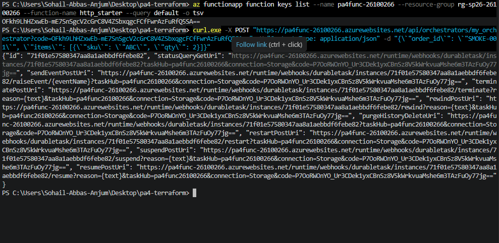

Description: The curl POST to the http_starter endpoint returns an instance id 
(71f01e57580347aa8a1aebbdf6febe82) and a statusQueryGetUri, proving the 
orchestration engine started successfully and checkpointed the new instance.

### Evidence 4.3: Expected Failed Status Before Downstream Wiring

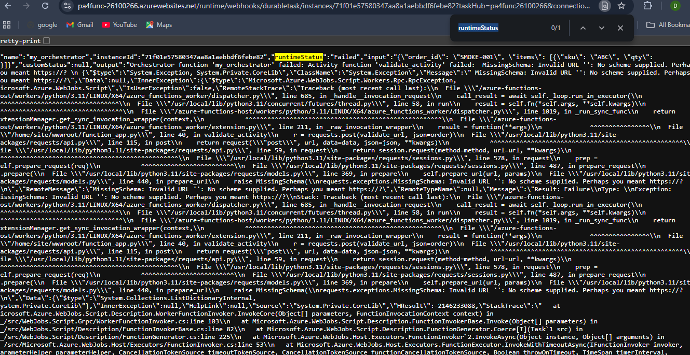

Description: Polling the statusQueryGetUri shows runtimeStatus: Failed with 
an error in validate_activity: MissingSchema: Invalid URL — because 
VALIDATE_URL is not yet configured. This is the expected checkpoint: the 
Function App and orchestrator are working correctly, only the downstream 
AKS validator is missing and will be wired in Task 5.

---

## Task 5: AKS Validator (15 points)

### Evidence 5.1: AKS Cluster Overview

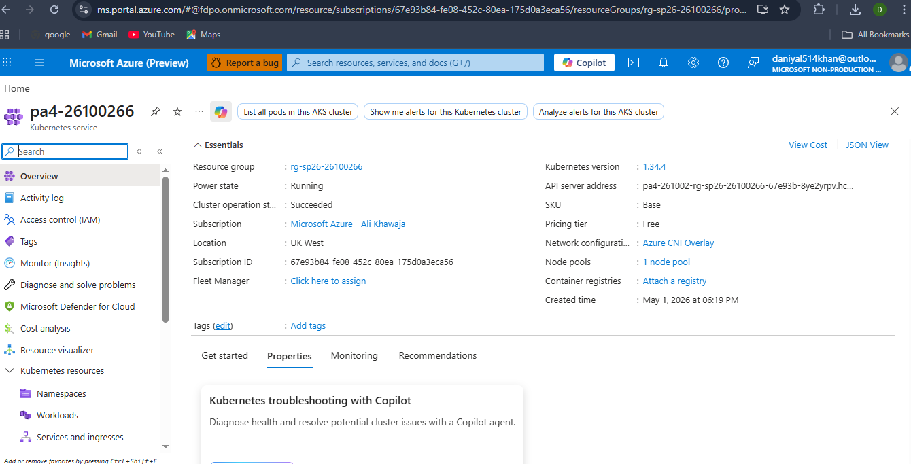

Description: The AKS cluster pa4-26100266 is deployed in the rg-sp26-26100266 
resource group, UK West region, with Cluster operation status: Succeeded and 
Power state: Running. It uses 1 node pool with Kubernetes version 1.34.4.

### Evidence 5.2: Kubernetes Nodes and Pods

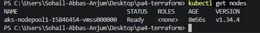

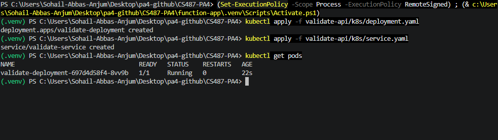

Description: The first screenshot shows the AKS node 
aks-nodepool1-15846454-vmss000000 in Ready state running Kubernetes v1.34.4. 
The second screenshot confirms the validator pod 
validate-deployment-697d4d58f4-8vv9b is Running with 1/1 containers ready 
after applying the deployment.yaml and service.yaml manifests.

### Evidence 5.3: Kubernetes Service

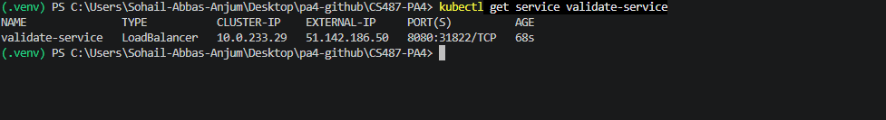

Description: The validate-service is of type LoadBalancer with EXTERNAL-IP 
51.142.186.50 exposed on port 8080. Azure provisioned this public IP 
automatically, giving the Durable Function a stable endpoint to call 
during every order validation.

### Evidence 5.4: Validator API Tests

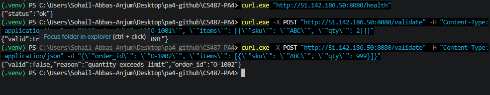

Description: Three tests confirm the validator works correctly: GET /health 
returns {"status":"ok"}; POST /validate with qty=2 returns valid:true; 
POST /validate with qty=999 returns valid:false with reason "quantity exceeds 
limit". The validator rejects any order where qty > 100.

### Evidence 5.5: Function App VALIDATE_URL

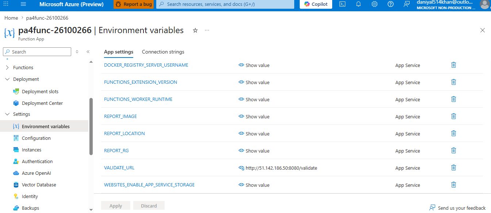

Description: The Function App pa4func-26100266 environment variables show 
VALIDATE_URL set to http://51.142.186.50:8080/validate — the AKS LoadBalancer 
external IP. The validate_activity reads this at runtime to know where to 
POST order payloads for validation.

### Evidence 5.6: AKS Idle Behavior

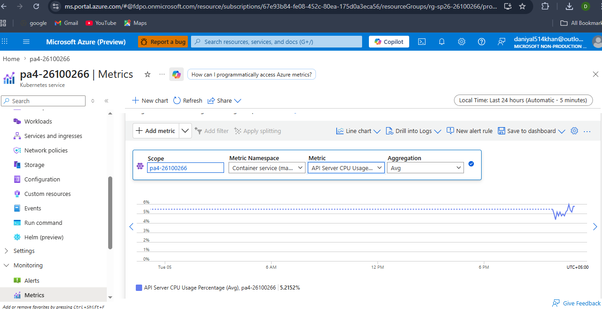

Description: The AKS cluster metrics show API Server CPU usage hovering around 
5% even with no active orders being processed. Unlike ACI which exits when done, 
the AKS node keeps running continuously — the validator pod stays alive 24/7, 
incurring constant compute cost regardless of traffic.

---

## Task 6: ACI Report Job (15 points)

### Evidence 6.1: Blob Container

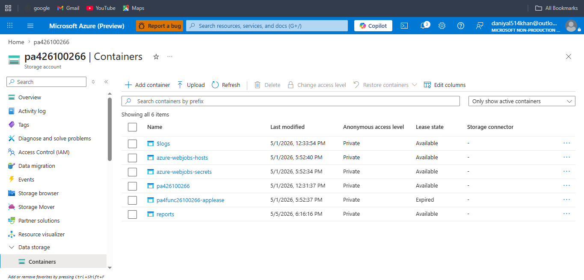

Description: This screenshot shows the reports container inside the pa426100266 storage account. This is the dedicated location where all generated PDF reports are stored after the ACI job completes its run.

### Evidence 6.2: Manual ACI Run

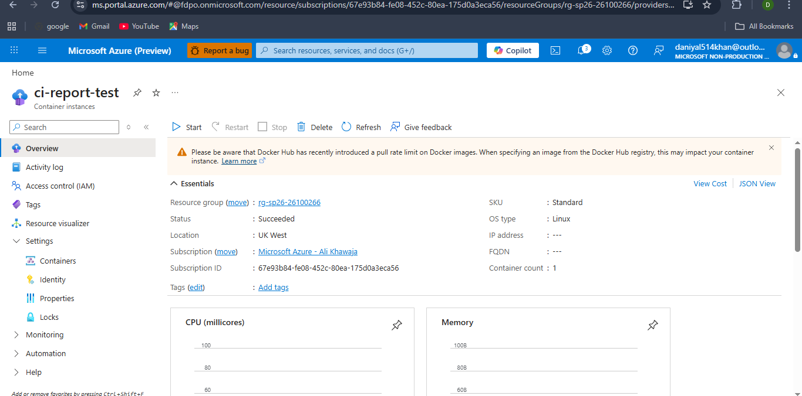

Description: The overview for ci-report-test shows a status of Succeeded. This task-based container is designed to perform its work and then exit, moving to a terminated state once the PDF is successfully uploaded.

### Evidence 6.3: ACI Logs

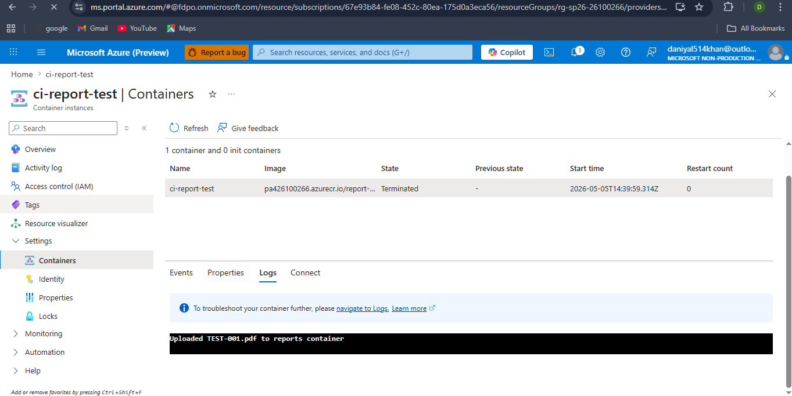

Description: The logs for the container instance explicitly confirm the successful execution of the job, stating "Uploaded TEST-001.pdf to reports container". This proves the internal report-generation script functioned as intended.

### Evidence 6.4: Generated PDF

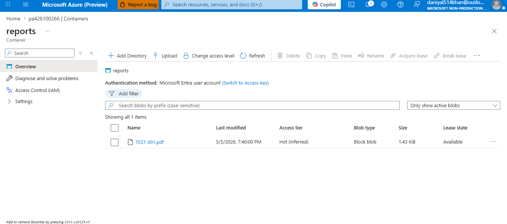

Description: This screenshot shows the actual TEST-001.pdf file sitting inside the reports blob container. This confirms the ACI job successfully wrote the output to storage, validating the end-to-end functionality of the report-job service.

### Evidence 6.5: Function App Managed Identity and IAM

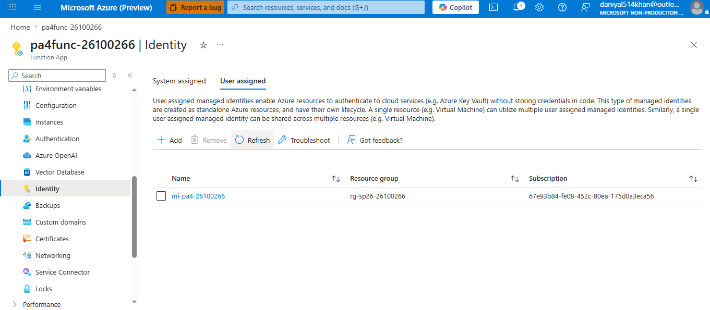

Description: The Function App pa4func-26100266 is configured with a user-assigned managed identity named mi-pa4-26100266. This identity provides the orchestrator with the necessary permissions to authenticate and programmatically create ACI resources within the resource group without hardcoding secrets.

### Evidence 6.6: Report App Settings

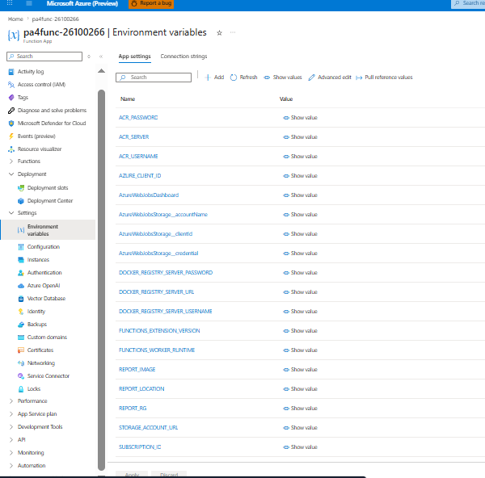

Description: These environment variables, including REPORT_IMAGE, STORAGE_ACCOUNT_URL, and ACR_SERVER, provide the configuration details the Function App needs to deploy the report container. These settings ensure the ACI job pulls the correct image and knows where to upload the final report.

---

## Task 7: End-to-End Pipeline (15 points)

### Evidence 7.1: Web App Wiring

Description: The Web App is configured with FUNCTION_START_URL and FUNCTION_STATUS_URL environment variables, which allow the frontend to trigger the Durable Function's HTTP starter and poll the status query endpoint for orchestration updates.

### Evidence 7.2: Happy Path UI

Description: A valid order (HAPPY-001) is submitted via the UI, which transitions from a "Running" state (showing a live instance ID) to "Completed". The final result provides a link to the generated PDF report, which correctly displays the order details.

### Evidence 7.3: Backend Participation

Description: The live log stream captures the Function App executing the http_starter, my_orchestrator, and activities in sequence. The authenticated CLI download confirms the PDF was successfully written to and retrieved from the reports blob container.

### Evidence 7.4: Reject Path UI

Description: Submitting an order with a quantity of 101 triggers the validation logic within the AKS service, resulting in a "Rejected" status in the UI with the reason "quantity exceeds limit". This demonstrates the orchestrator successfully short-circuiting the pipeline before generating a report.

---

## Task 8: Write-up and Architecture Diagram (5 points)

### Evidence 8.1: Architecture Diagram

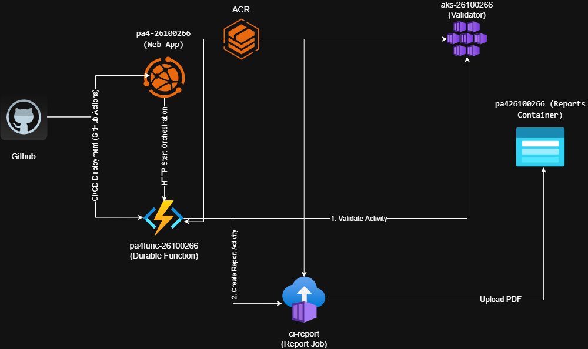

Description: This architecture diagram illustrates the end-to-end TaskFlow pipeline, showing the integration between all required cloud components. The workflow originates in GitHub, which drives CI/CD deployment via GitHub Actions to both the App Service (frontend) and the Durable Function (orchestrator). Azure Container Registry (ACR) acts as the central hub, providing Docker images to AKS, ACI, and the Function App. The orchestration logic sequences the process by first invoking the AKS validator and then spinning up an Azure Container Instance (ACI) for report generation. The final PDF is uploaded to the Azure Blob Storage reports container, with all cross-service permissions managed securely via Azure IAM (Managed Identity).

### Question 8.2: Service Selection

**App Service:** Chosen to host the frontend because it provides a fully managed platform with built-in integration for GitHub Actions. This allows for seamless CI/CD without the overhead of managing a web server or container cluster for a simple Node.js interface.

**Durable Functions:** Acts as the central orchestrator to manage stateful workflows. It was selected because it can handle long-running, asynchronous tasks (like waiting for a container to generate a PDF) while providing a built-in status API for the frontend to poll.

**AKS (Azure Kubernetes Service):** Used for the validator service because it requires a persistent, scalable environment. AKS allows the validator to stay active and ready to handle high-frequency requests across multiple pods, ensuring the business logic is always available.

**ACI (Azure Container Instances):** Ideal for the report-job because it follows a serverless run-to-completion model. It spins up only when a valid order is processed and shuts down immediately after the PDF is uploaded, ensuring you only pay for the exact seconds of compute used.

---

### Question 8.3: ACI vs AKS

**Idle Behavior:** AKS remains always on, maintaining a persistent VM scale set that consumes resources even when no orders are being processed. In contrast, ACI has a zero-idle footprint, it is created on-demand and deleted upon completion.

**Cost Behavior:** Based on the resource group overview, AKS is significantly more expensive due to the 24/7 billing of the underlying nodes. ACI is highly cost-efficient for this pipeline as it only incurs charges during the active duration of the report generation job.

**Operational Model:** AKS provides a complex orchestration layer suited for long-lived microservices that need internal load balancing and self-healing. ACI provides a simplified, low-overhead model for isolated, short-lived tasks where managing a full cluster would be unnecessary.

---

### Question 8.4: Durable Functions vs Plain HTTP

**State Management:** Durable Functions automatically persist the progress of the workflow. If the orchestrator crashes mid-pipeline, it can replay its state to resume exactly where it left off, which is impossible with standard stateless HTTP calls.

**Long-Running Task Coordination:** It eliminates the need for complex callback logic. By using the `call_activity` pattern, the orchestrator can wait minutes for an ACI job to finish without timing out the original HTTP request from the user, providing a clean status URI for the frontend instead.

---

### Question 8.5: Cost Review

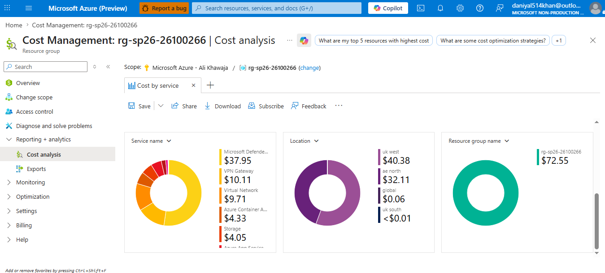

Description: Cost analysis scoped to rg-sp26-26100266 shows a total spend of $72.55. The most expensive service is Microsoft Defender for Cloud at $37.95, followed by VPN Gateway at $10.11 and Virtual Network at $9.71. Azure Container Apps accounts for $4.33 and Storage for $4.05. The AKS cluster's underlying compute contributes to the VPN Gateway and Virtual Network costs since AKS provisions these networking resources automatically when the cluster is created.

---

### Question 8.6: Challenges Faced

**AKS Power State & DNS:** During testing, the `validate_activity` failed with a `no such host` error. I debugged this by checking the AKS cluster status in the portal and realized it had been stopped to save credits. Restarting the cluster and verifying the LoadBalancer IP resolved the connectivity issue.

**Container Image Caching:** I encountered a `KeyError: STORAGE_CONN` because the Function App was aggressively caching an older version of my container. I solved this by tagging my updated code as `v2`, pushing it to ACR, and using the Azure CLI to force the Function App to pull the new specific tag.

---
